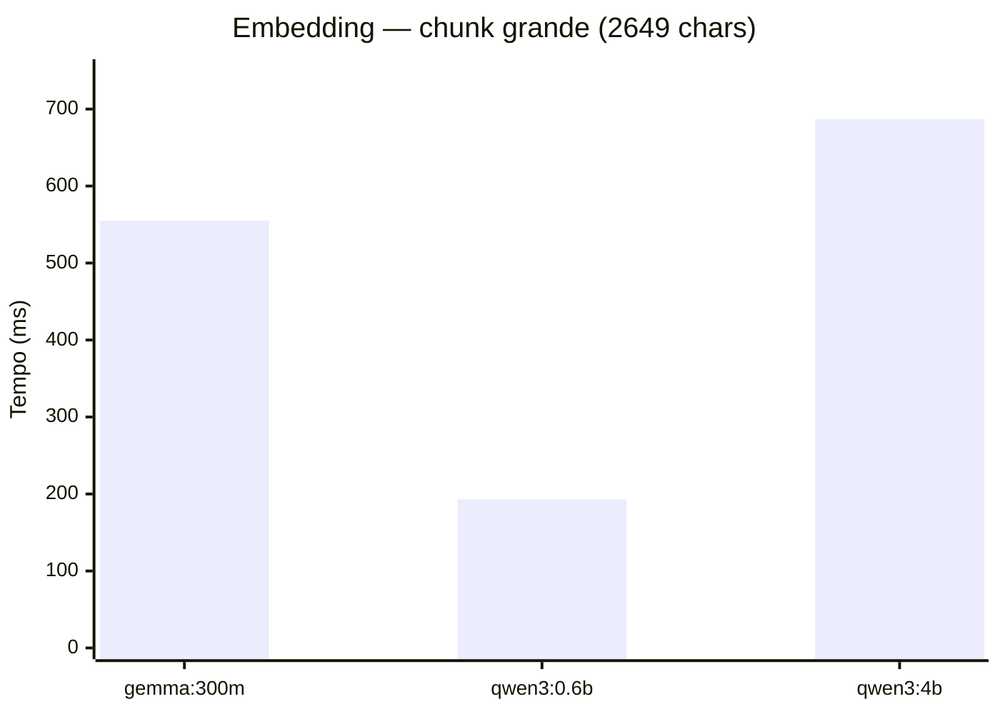
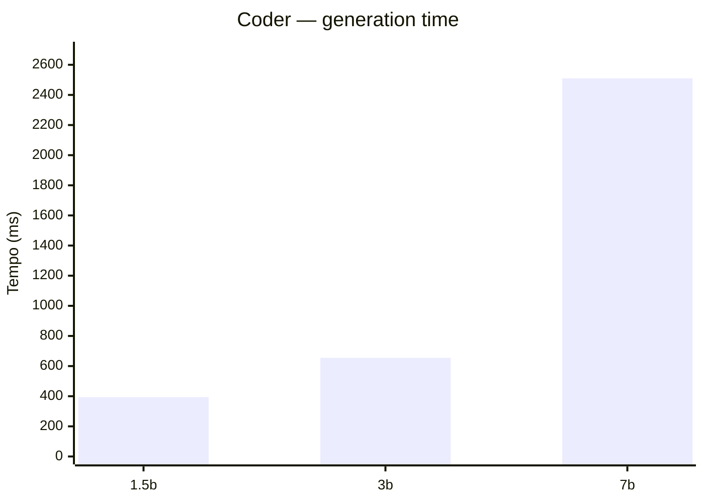
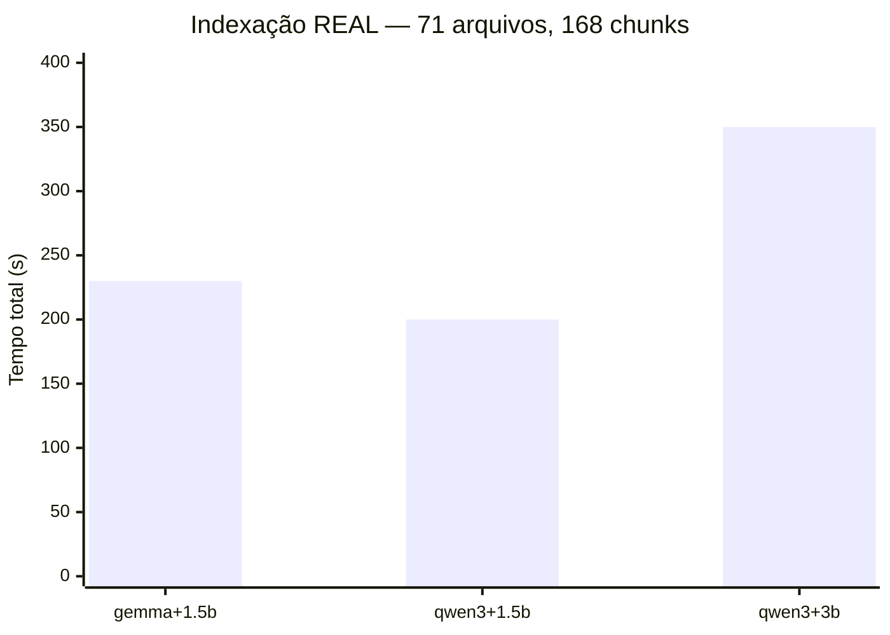
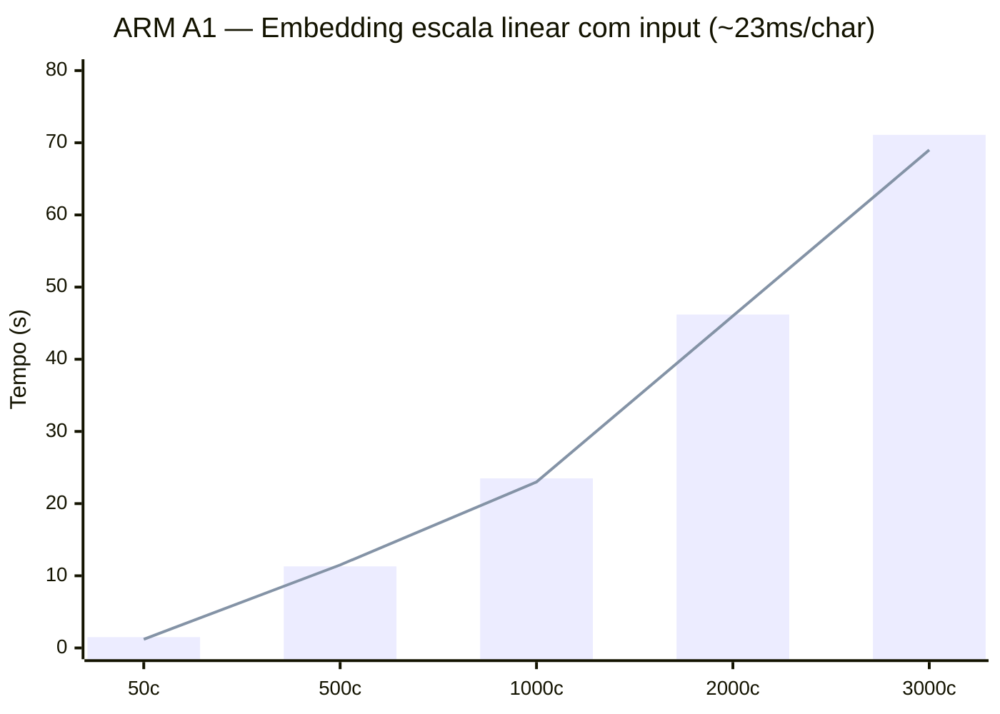

# Benchmarks — LLM Inference para local-rag

Data: 2026-03-15

## Predabook — RTX 2060 (6GB VRAM)

### Embedding Models (GPU, individual, warm)

| Modelo | 232c | 682c | 2649c | Dims | VRAM |
|--------|------|------|-------|------|------|
| embeddinggemma:300m | 140ms | 185ms | 555ms | 768 | 1.1GB |
| qwen3-embedding:0.6b | 92ms | 108ms | 193ms | 1024 | 1.5GB |
| qwen3-embedding:4b | 110ms | 195ms | 687ms | 2560 | 3.9GB |

### Coder Models (GPU, individual, warm)

| Modelo | Gen time | VRAM | GPU fit |
|--------|----------|------|---------|
| qwen2.5-coder:1.5b | 394ms | 1.4GB | 100% GPU |
| qwen2.5-coder:3b | 655ms | 2.4GB | 100% GPU |
| qwen2.5-coder:7b | 2510ms | 5.4GB | 28% CPU / 72% GPU |

### Combos — VRAM (ambos carregados)

| Combo | VRAM total | 100% GPU? |
|-------|-----------|-----------|
| qwen3:0.6b + coder:1.5b | ~2.9GB | Sim |
| qwen3:0.6b + coder:3b | ~3.9GB | Sim |
| embeddinggemma + coder:3b | ~3.5GB | Sim |
| qwen3:4b + coder:3b | ~6.3GB | Não (estoura) |
| qwen3:0.6b + coder:7b | ~6.9GB | Não (estoura) |

### Indexação REAL — api/src/modules (71 arquivos, 168 chunks)

IMPORTANTE: benchmarks individuais via curl NÃO representam o pipeline real.
O local-rag faz parse + chunk + generate description + 2 embeds + upsert por chunk.

| Combo | Tempo total | Por chunk | vs baseline |
|-------|-------------|-----------|-------------|
| gemma + coder:1.5b (baseline) | **230s** | **1.37s** | — |
| qwen3:0.6b + coder:1.5b | **200s** | **1.19s** | 13% mais rápido |
| qwen3:0.6b + coder:3b | **350s** | **2.08s** | 52% mais lento |

**Escolhido: qwen3-embedding:0.6b + qwen2.5-coder:3b** — mais lento na indexação,
mas melhor qualidade de embedding (1024 dims) e descriptions. Indexação é one-time.

### Tuning: OLLAMA_NUM_PARALLEL=2 + FLASH_ATTENTION=1

Testado com ambos modelos warm, GPU idle.

| Operação | Sem flags | Com flags | Diferença |
|----------|-----------|-----------|-----------|
| Embed sequential | ~220ms | ~214ms | Igual |
| Coder sequential | ~960ms | ~958ms | Igual |
| **Parallel (embed+coder)** | ~4270ms | **~2565ms** | **40% mais rápido** |
| VRAM | 3132 MiB | 3219 MiB | +87 MiB |

NUM_PARALLEL=2 permite embed e coder rodarem ao mesmo tempo na GPU.
FLASH_ATTENTION=1 reduz VRAM do KV cache sem impacto em velocidade.

### Leitura (recall) — queries reais, modelo warm

| Input | Tempo |
|-------|-------|
| 16 chars | 472ms |
| 42 chars | 690ms |
| 65 chars | 1.1s |
| 200 chars (memory_remember) | 2.3s |

(Medido no ARM — na GPU local é sub-200ms)

---

## Cloudarm — Oracle ARM A1.Flex (4 cores, 24GB RAM, DDR4 ~25GB/s)

Kernel: 6.12.76 (NixOS 25.11)

### Embedding por tamanho de input (embeddinggemma:300m, CPU idle)

| Input | Tempo |
|-------|-------|
| 50 chars | 1.5s |
| 500 chars | 11.3s |
| 1000 chars | 23.5s |
| 2000 chars | 46.2s |
| 3000 chars | 71.1s |

Escala ~23ms/char. Memory bandwidth (~25 GB/s) é o bottleneck.
MAX_CHUNK_CHARS do local-rag = 3000 → estoura timeout 60s do client.

### Conclusão ARM

ARM Ampere A1 **não serve para indexação** (chunks grandes).
Recall com queries curtas (50-200 chars) funciona (0.5-2.3s).
Apple Silicon (M1/M4) tem 3-20x mais bandwidth — não é comparável.

## Lições aprendidas

1. Benchmarks individuais via curl não representam pipeline real — sempre medir end-to-end
2. Memory bandwidth determina velocidade de inferência, não clock/cores
3. Modelos que cabem na GPU juntos evitam swap — verificar com `ollama ps`
4. DESC_CONCURRENCY=5 do local-rag causa timeouts em hardware lento
5. embed-dim DEVE ser explícito na config — default é 768, qwen3:0.6b gera 1024
